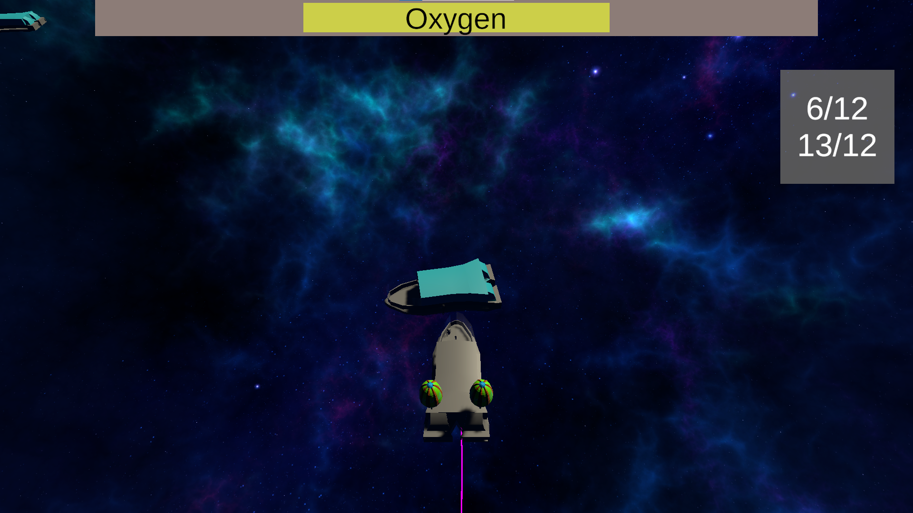

# Prototype "Space" MiniGameJame

Space Jame is a survival game, in which you lost the signal to all your fellow space captains and they are running out of air. Your mission is to fly towards them and let your crew rescue them, as well as their cargo, which can be used to increase your cargo area back at the space station. Save as many people as you can! 

  

## Controls

Movement 

- W: Forward
- A: Left
- D: Right
- E: Interaction
- U: Upgrade Cargo